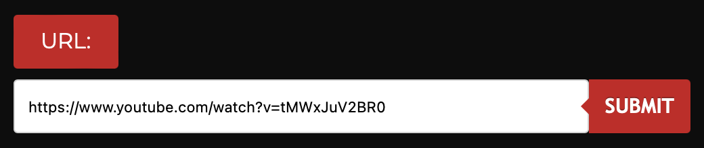
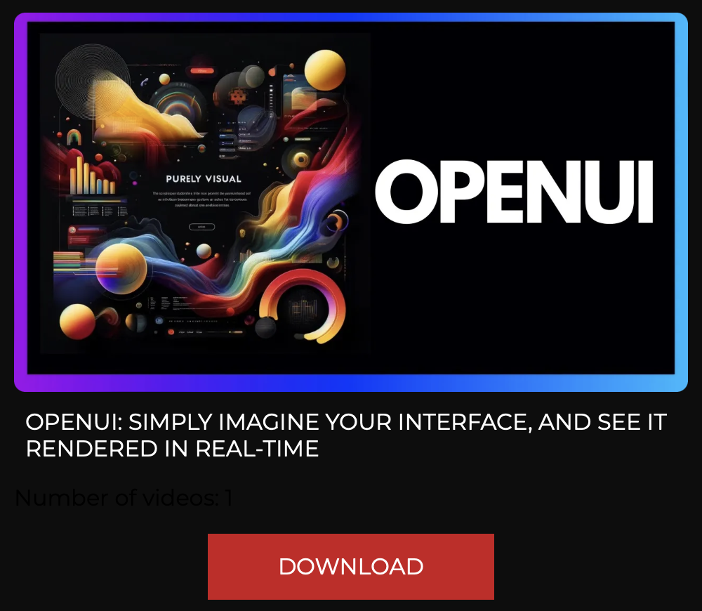

# YouTube Videos Downloader

Welcome to the YouTube Video Downloader project! This simple web application allows users to download YouTube videos and playlists with ease. Check out the live demo [here](https://bit.ly/yt-dlp-mp4).

## Features

- Download individual YouTube videos or entire playlists.
- Retrieve video information such as title and thumbnail before downloading.
- Directly save downloaded videos to your local system.

## Technologies Used

- Flask: Python web framework for building the server-side application.
- YouTube-DL: Python library for downloading YouTube videos and playlists.
- HTML/CSS/JavaScript: Front-end technologies for building the user interface.
- Bootstrap: Front-end framework for styling and layout.

## Setup

1. Clone the repository:

   ```
   git clone https://github.com/iABn0rma1/YT-VideoDownloader.flask
   ```

2. Install dependencies:

   ```
   pip install -r requirements.txt
   ```

3. Run the Flask application:

   ```
   python app.py
   ```

4. Access the application in your web browser at `http://localhost:5000`.

## Usage

1. Enter the URL of the YouTube video or playlist you want to download.
2. Click the "Submit" button to fetch video information.
3. Review the video details and click the "Download" button to save the video to your system.

## Screenshots


*Enter the URL of the YouTube video or playlist.*


*Review video information before downloading.*

## Contributing

Contributions are welcome! If you encounter any issues or have suggestions for improvements, feel free to open an issue or submit a pull request.

---
